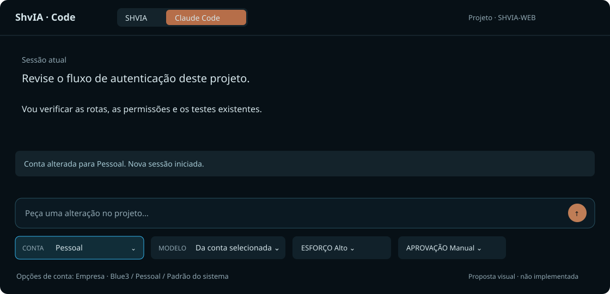

> **Archived proposal (05/09/2026).** This is the design that circulated outside the
> repository before the feature existed; it was implemented in 1.4.16–1.4.20 and the
> living document is [CONTAS-CLAUDE.md](CONTAS-CLAUDE.md) (decision: ADR-033). Kept
> untouched, with its diagram [CONTAS-CLAUDE-proposta-20260905.svg](CONTAS-CLAUDE-proposta-20260905.svg),
> because the reasoning that led to the decision is what a reader needs when the
> decision is questioned. Moved out of the route repository (`shvia-rota`) on 08/09/2026.

# Claude Code account profiles — implementation proposal

Status: proposed; no runtime behavior implemented. Date: 2026-09-05.

## Goal

Let a user choose their company or personal Claude Code account in Code mode,
with the Claude Code engine selected. Reuse existing local login profiles; do
not add provider API keys or a second login system to ShvIA.

## Verified starting point

The local shell aliases set different configuration directories:

| Alias | Configuration directory | Proposed label |
| --- | --- | --- |
| `claude-b3` | `~/.claude-blue3` | Empresa · Blue3 |
| `claude-me` | `~/.claude-pessoal` | Pessoal |

These paths were verified in the user's shell configuration. Credential contents
were not read. A directory or alias existing does not prove its login is valid.

The Desktop directly starts `claude-runner`; it does not invoke shell aliases.
`src-tauri/src/code_bridge.rs` has separate process-launch paths for
`claude_models()` and the Claude branch of spawn. Neither currently takes an
account profile. Both must receive the same selected environment.

`claude-runner/claude-runner.mjs` uses the Agent SDK and keeps `sessionId` for
subsequent `resume` calls. Its `--modelos` branch runs before the existing
`ANTHROPIC_API_KEY` removal. Account selection must cover discovery and turns,
with credential precedence checked consistently before either SDK call.

The UI is served by SHVIA-WEB (`public/js/code-mode.js`), while process creation
belongs to SHVIA-DESKTOP. This requires coordinated changes in both repositories.

## Proposed interface

User-facing copy remains Portuguese. Add a compact CONTA selector in the existing
composer control row, beside MODELO, visible only for the Claude Code engine.
Replace the redundant fixed INFRA control there with CONTA rather than adding
another floating panel. Keep the engine switch in its current location.

- Options: `Empresa · Blue3`, `Pessoal`, and a compatibility `Padrão do sistema`.
- Make the active account explicit before sending; labels are user-defined
  profiles, not verified organization identities.
- Show missing/expired authentication as an inline actionable error. Do not
  describe a profile as connected based only on directory existence.
- While running or waiting for approval, disable account switching with a reason:
  `Aguarde o turno terminar ou interrompa antes de trocar a conta.`
- After switching: `Conta alterada para Pessoal. Nova sessão iniciada.` Preserve
  the visible transcript as history, separated from the new execution context.
- Do not silently fall back to another account or to an API-key billing path.
- On narrow windows let the control row wrap; retain visible labels, keyboard
  navigation, focus indication and a programmatic disabled explanation.

The SVG is a layout concept, not a screenshot or implemented screen.

## Architecture and contract

### Local profile registry

Store non-secret profile metadata in the Desktop application configuration:
profile ID, label and local configuration-directory path. Seed company/personal
profiles only when their known directories exist; do not create directories or
copy credentials. Other machines can register their own paths through native
settings. Do not parse or execute arbitrary shell alias definitions.

Keep a `default` profile to preserve current installations. Define and display
whether it resolves to an inherited configuration directory or the normal CLI
default. Never make a named profile silently resolve to `default`.

Persist the selected ID locally in the Desktop. Do not sync local paths or
credential files to Laravel, the gateway, localStorage or analytics.

### Native bridge

Proposed additions, subject to the bridge's existing protocol conventions:

- `claudeAccounts()` → IDs, labels, selected ID and non-secret availability.
- `claudeModels({accountId})` → models discovered under that profile.
- Claude spawn gains `accountId` and echoes the resolved ID in its ready event.

The page sends an allowlisted ID, never a filesystem path or shell command.
Rust resolves the ID through its local registry and sets `CLAUDE_CONFIG_DIR`
with `Command.env()` on the child process. Never modify the Desktop's global
process environment: multiple windows may use different accounts concurrently.
Use one shared account/environment resolver for model discovery and spawn.

Validate configured directories through native code. Unknown IDs and missing
paths fail explicitly. Do not expose raw directory contents or authentication
material through bridge responses or errors.

### Runner and credential precedence

Verify the installed SDK/CLI actually honors the chosen directory for both
supported-model discovery and message execution. Inspect environment precedence
for subscription login, explicit OAuth credentials, API keys and endpoint
configuration before choosing which inherited variables to remove. Do not
blindly remove unrelated proxy or corporate network configuration.

Move subscription-auth normalization ahead of every SDK entry point, including
`--modelos`. Apply the selected directory to each child explicitly. No shared
`claude logout/login`, no credential copying, no account switching through a
shell invocation. Authentication refresh remains owned by the official client.

### Session and asynchronous-state isolation

Bind runner identity to `(window, project, engine, accountId)`. Switching account
must close the old idle runner and start a fresh session without its `sessionId`.
Preserve gates, approval mode and filesystem confinement.

Tag model requests with the account ID and a request generation. Discard an old
account's delayed response. Scope any model cache by account and runner version.
Clear the old model selection while loading; select a model only from the new
account's successful catalog. Failure must block sending, not retain a model
that only the previous account could use.

Do not send previous-account conversation history to the new account by default.
Existing local transcript storage must be inspected and partitioned or annotated
by account so a restored transcript is not treated as resumable SDK context.
A future explicit history-transfer feature is outside this implementation.

## Delivery sequence

1. **Contract and native profile selection:** inspect all bridge dispatchers and
   platform adapters; add registry and capability negotiation. Preserve old
   Desktop/web combinations with the system-default behavior.
2. **Account-scoped runtime:** shared environment resolver; discovery and spawn;
   validate authentication precedence; session isolation and multiwindow behavior.
3. **Web selector:** capability-gated CONTA control, local selection persistence,
   loading/error/blocked states, race handling and transcript separation.
4. **Packaging and validation:** Linux first with both existing profiles, then
   macOS/Windows path and credential-store verification. Publish coordinated
   Desktop and web versions; the web control remains hidden on older Desktops.

No database migration or new dependency is expected. Confirm this after examining
the local settings implementation; do not introduce a service just for two profiles.

## Acceptance tests

- Each profile launches discovery and turns with its own configuration directory.
- Company and personal windows cannot overwrite each other's child environment.
- Unknown/missing profiles fail without launching or falling back.
- Credential-precedence checks apply to both `--modelos` and normal execution.
- Changing account never resumes the prior account's SDK session.
- Late discovery responses cannot overwrite the currently selected account/model.
- Switching is blocked during generation and pending approval.
- A restored transcript cannot silently become context for a different account.
- Old Desktop + new web keeps working without an unusable selector.
- Errors contain no tokens or credential contents.
- Test native code and runner logic with controlled process doubles; test the
  actual frontend's change/send flows, not only source-string assertions.
- Run Rust tests/clippy, runner tests and frontend build, then manually verify
  both authenticated profiles. Any real prompt used for validation must be
  explicitly scoped and reported as potentially consuming subscription usage.

## Scope and open checks

This implements a proposal for two existing local profiles, not organization
membership management. Verify SDK credential-store behavior separately on each
OS; the Linux aliases do not establish portability. Model availability and usage
limits must come from the selected account, not a hardcoded Personal/Teams table.

This document does not authorize copying credentials, changing login state,
installing a new runtime or sending a paid test prompt.
